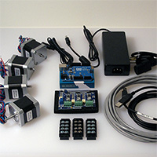
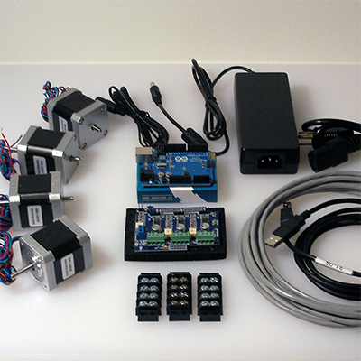

# Testing Electronics
## Overview
=======
    

Before we get all crazy bolting our new machine together, let's give our electronics a test run. It's frustrating to have the machine fully assembled, only to find there is a problem with your electronics that may require disassembly! Let's cut that off at the pass and give everything a thorough checking first.

## Requirements
* Arduino with Grbl firmware
* (Arduino) gShield (formerly GrblShield)
* Stepper motors x 4pcs
* Power Supply with wall plug
* Barrel Connector
* Small screwdriver
* Computer with UGS installed
* USB Cable (A to B)
* Patience (just a little bit)

##Connect Arduino
Now that we have everything gathered up, you should find yourself with a setup similar to this:

  

First thing that we do is plug our Arduino into the computer.

Remember, the big end of the cable goes into the Arduino. 

Chances are, the Arduino will be recognized by your computer. 
If not, download the appropriate drivers/software for your platform (do not proceed beyond Step #4 or you will erase Grbl):

* [Mac OS X](http://arduino.cc/en/Guide/MacOSX#toc2)
* [Windows](http://arduino.cc/en/Guide/Windows#toc2)
* [Linux]([http://playground.arduino.cc/Learning/Linux)

##Communication / Control Program

Once the Arduino is recognized by your computer system, install a Communication / Control Program.

###UGS
  
*(universal gcode sender by will winder)*

If Java isn't an option for your machine there are other [Communication/Control programs](http://www.shapeoko.com/wiki/index.php/Communication_/_Control).

##Hook Stuff Up##

Please note the gShield takes two different sizes of screwdriver.

##Go For a Spin##

Attach tape to the motor shafts so as to more easily see the rotation.

##Another Spin
##And a Final Spin
