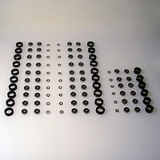
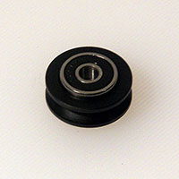
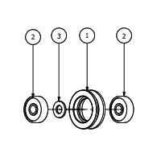
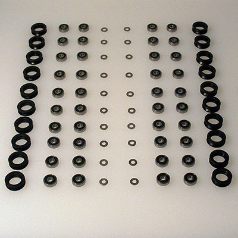
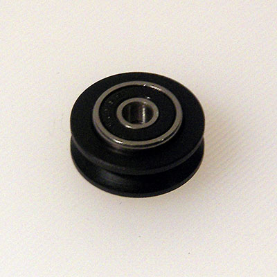
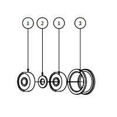
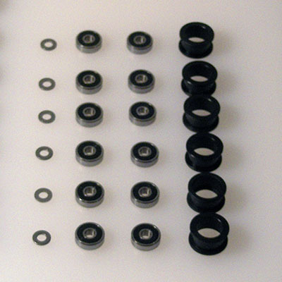
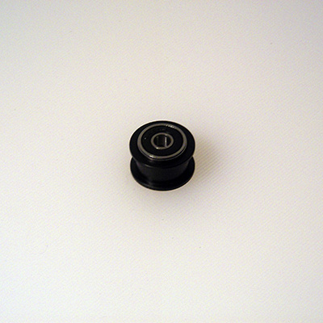

#V-wheels and Smooth Idlers

Makerslide uses V-wheels to allow for movement along the rails which it affords.

The belts which the stepper motors drive the X- and Y-axes which require smooth idlers to route the belts so that they are held against the pulleys on the motor shafts.

##V-Wheels

###Requirements

####Parts

* Delrin V-Wheels (25202-01) x 20pcs
* 5x16x5mm Bearings (25196-01) x 40pcs
* Precision Washers (25201-01) x 20pcs

####Tools

* one M5 bolt to align the pieces during assembly

###Assemble all of the V-Wheels (20 wheels total)
1. Take one ball bearing, and insert it into the Delrin V-Wheel
2. Using one of the M5 x 20mm BHCS, slide the wheel over the screw
3. Slide a single precision washer around the screw
4. Slide another bearing around the screw
5. Using your thumbs, squeeze the assembly together. There will be a bit of friction getting the bearings settled into the wheel. When you tighten the wheel to the plate, you will squeeze the entire thing together tightly.
6. Repeat this procedure for the remaining V-Wheels (20 total)

Alternate, assembly-line procedure for the V-Wheels:

1. Arrange all the pieces on a stable, flat work surface
2. Place one bearing into each V-Wheel 
3. Place a V-Wheel bearing side down onto the longest M5 bolt which is available, add a precision shim, then another bearing, press things together — repeat until the bolt is full, clear the bolt and repeat until done

##Smooth Idlers

###Requirements

####Parts

* Smooth Idler Drum (25197-01) x 6pcs
* 5x16x5mm Bearings (25196-01) x 12pcs
* Precision Washers (25201-01) x 6pcs

####Tools

* one M5 bolt to align the pieces during assembly

###Assemble all of the smooth idlers (6 idlers total)

1. Take one ball bearing, and insert it into the open end of the smooth idler
2. using one of the M5 x 30mm BHCS, slide the idler over the screw
3. Slide a single precision washer around the screw
4. Slide another bearing around the screw
5. Using your thumbs, squeeze the assembly together. A small portion of the second bearing will be protruding from the edge of the smooth idler. This is normal. We will tighten the entire assembly when the idlers gets bolted to the motor mount plate
6. Repeat this procedure for the remaining smooth idlers (6 total)

