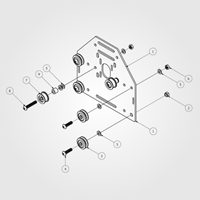
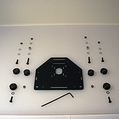
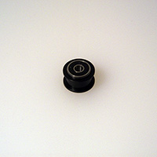
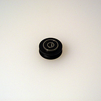
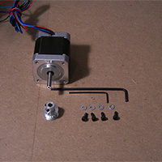
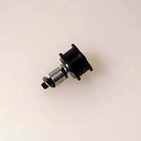
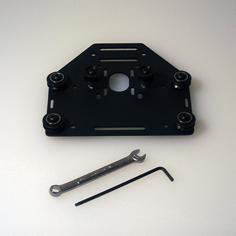

# Carriages
## Overview

This step is the bulk of the work required to assemble your machine. There are two different styles of plates that we will be assembling in this step. The first style includes a stepper motor, there are 3 of these plates total, and they will be used to drive both your X- and Y-axes. The other style is nearly identical to the first, with the exception of not having a stepper motor or smooth idlers attached. This plate will be used to connect your Z-axis assembly to your X-axis assembly. 

The 3 plates with stepper motors are identical and interchangeable. The plates are symmetrical, so there is no such thing as a front and a back (as they're the same) until one determines this by attaching parts. Keep in mind that your stepper motor will go on the opposite side of your wheels and smooth idlers.

It might be easier and more straight-forward to assemble all four of them to match the Z-axis motor carriage mount plate, then set one aside for that, and add smooth idler wheels to make the other three.

 
 
##Motor Mount Carriages (PS20022) - 3 total

###Requirements

####Parts

 *   Motor Mount Plate (12ga) (26029-01) x 3pcs
 *   Eccentric Nut (30158-01) x 6pcs
 *   (from previous step) - Dual Bearing V-Wheel (25203-02) x 12pcs
 *   (from previous step) - Smooth Idler (25197-02) x 6pcs
 *   M5 x 20mm Button Head Cap Screw (PS20004) x 12pcs
 *   M5 Flat Washer (25287-02) x 36pcs
 *   M5 Hex Nut (25284-02) x 12pcs
 *   M5 x 30mm Button Head Cap Screw (25286-05) x 6pcs
 *   3/8" x 5/16" x #12 bore Aluminum Spacer (25312-14) x 6pcs
 *   M3 SHCS x 12 pcs (for attaching the stepper motors)
 *   M3 Flat Washer x 12 pcs (for attaching the stepper motors)
 *   GT2 pulley (to attach to the stepper motors)

####Tools

 * M3 Hex Key
 * 2.5mm Hex Key (used for the M3 screws if attaching the motor)
 * 1.5mm Hex Key (used for the set screws in the pulley)

These are the plates that will mount on either end of the gantry and on the rear of the X-Axis.

1. Connect V-Wheels to the plate
	- two static at the top
	- two eccentric at the bottom
2. Connect the smooth idlers to plate
	- two total
	- take note of the orientation of the bolt
	- take note of the orientation of the bearings/idler
3. Attach your stepper motor
	- Using 4 x M3x6mm SHCS, attach the stepper motor
	- Use an M3 washer between the SHCS and the plate

Please note that the above image does not show the stepper motor in place. As previously noted, one should attach at least one stepper motor for the X-axis plate, as it's difficult to attach it once the gantry carriage is assembled. Use 4 M3 screws, 4 M3 washers and also attach the G2 pulley.

