# Z-Axis Assembly

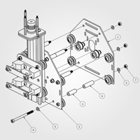
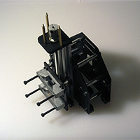
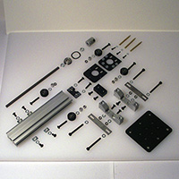
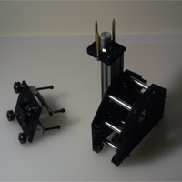

The Z-axis assembly is comprised of several sub-assemblies. When assembling it, it is best to select a Motor Mount Carriage (PS20022) which already has a stepper motor in place.

##Z Assembly Carriage (PS20021)

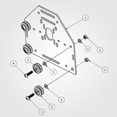  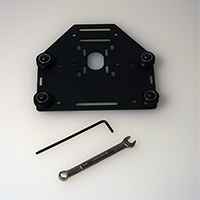
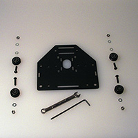 

###Requirements

####Parts

- 1 x 26029-01 Motor Mount Plate (12ga)
- 2 x 30158-01 Eccentric Nut
- 4 x 25203-02 Dual Bearing V-Wheel Kit (assembly)
- 4 x PS20004 M5x20mm BHCS
- 6 x 25287-02 Flat Washer, M5
- 2 x 25284-02 M5 Hex Nut

This is the plate the Z-axis will attach to (it is identical to the Motor Mount Carriage (PS20022) assembled in the previous step, but without smooth idlers. It sits on the front of the gantry and will be connected to the X-axis motor mount plate via rigid aluminum spacers. We will build the plate first, and then attach the two together.

1. Connect V-Wheels to plate
	- two static at the top
	- two eccentric at the bottom

##Spindle Carriage Assembly (PS20029)

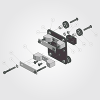  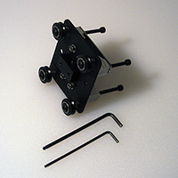 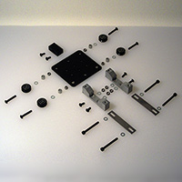 

###Requirements

####Parts

- 1 30287-01 Spindle Mount Plate (12ga)
- 1 PS20010 13mm x 35mm x 20mm Delrin Lead nut
- 10 25287-02 Flat Washer, M5
- 6 25284-02 M5 Hex Nut
- 2 PS20012 Universal Spindle Mount
- 2 30158-01 Eccentric Nut
- 4 25202-01 V-Wheel, Delrin
- 8 25196-01 5mm x 16mm x 5mm Bearing
- 4 25201-01 Precision 1mm spacer
- 4 25312-14 3/8" x 5/16" x #12 bore, aluminum spacer
- 4 25286-05 M5 x 30mm, BHCS
- 6 25286-02 M5 x 12mm, BHCS
- 2 PS20013 Universal Spindle Mount strap
- 4 PS20005 M5 x 45mm, SHCS

Place the V-wheels and the Delrin Lead nut (for the Z-axis Rail Assembly) on one side of the Spindle Mount Plate and the Universal Spindle Mount Straps on the other. The Eccentric Nuts go in the larger holes.

##Z-Axis Rail Assembly (PS20028)

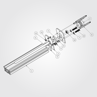  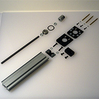
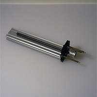 

**Note:** The above exploded view does not show the wavy washer (PS20017) which goes on top of the flanged bearing.

One should also attach the motor for the Z-axis at this time.

###Requirements

####Parts

- 1 25142-07 Z Axis Rail MakerSlide Extrusion 200mm
- 1 25772-02 Z-Axis Flexible Coupler 5mm 8mm bore
- 2 30288-01 Z-Axis Motor Mount Plate (12ga)
- 1 30169-01 8x22x7mm flanged bearing
- 1 PS20017 Wave Disc Spring, .901"ID, 1.159" OD, .013" thickness
- 1 30289-01 Z-Axis Shim Plate (12ga)
- 1 PS20011 M8 Threaded Rod Stainless Steel, 200mm
- 2 25287-02 Flat Washer, M5
- 3 PS20014 Brass Standoff spacer M3 male x M3 female 50mm
- 4 PS20016 5mm x 10mm x 1mm thick, Nylon Spacer
- 2 PS20004 M5x20mm BHCS
- 6 PS20015 3mm x 8mm x 1mm thick, Nylon Spacer
- 3 25285-10 M3 x 12mm, SHCS
- 3 25287-03 Flat Washer, M3
- 2 PS20007 M8, Hex Nut

####Tools

 - 2 13mm (or 1/2") open end wrenches
 - M3 Hex Key

**Note:** Depending on how deeply tapped on the stepper motor and how long the threads are on the brass standoffs, it may be necessary to add additional M3 washers when attaching the motor using the brass standoffs.

Assemble this from the inside out, starting with the smallest pieces and attaching them to the bottom Z-Axis Motor Mount Plate — slide the 12mm M3 screws through the appropriate holes, then stack the Nylon Spacers (PS20015), then place the wavy washer onto the flanged bearing, insert that into the second Z-axis Motor Mount Plate, insert the two M5 bolts, add the last two Nylon Spacers and slide the top and bottom Z-axis Motor Mount Plates together. Loosely thread on the brass M3 standoffs. Place the Z-axis Shim Plate on top of the Z Axis Rail (200mm MakerSlide) and attach it using the M5 bolts.

###Threaded Rod

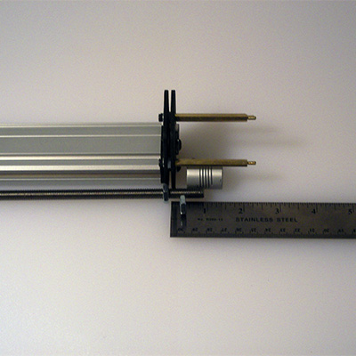

Compare the threaded rod (PS20011) to the assembly thread on one M8 Hex Nut (PS20007) far enough down to allow room for the flanged bearing, a second hex nut and for the  threaded rod to be just short of half-way into the flexible coupler. Before tightening things, ensure that the motor shaft will also fit just short of half-way into the flexible coupler.

###Jam Nuts

Slip the threaded rod through the flanged bearing, thread on the second hex nut and use the wrenches to tighten them. Slip on the flexible coupler.

###Stepper Motor

If possible, attach the stepper motor by screwing in the 3 brass M3 standoffs --- use equal stacks of M3 washers to ensure the threads are well-engaged and not bottoming out.

Tighten everything.

###Z-Axis

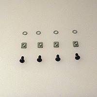

- 1 PS20021 Z-Assembly Carriage
- 1 PS20028 Z-Axis Rail Assembly
- 1 PS20029 Spindle Carriage Assembly
- 4 25287-02 Flat Washer, M5
- 4 26016-01 M5 insertion nut
- 4 25286-01 M5 x 10mm, BHCS

Insert the 10mm M5 bolts with an M5 washer into the Z-Assembly Carriage (PS20021) from the side the V-wheels are on, thread on the M5 insertion nuts, then slide the Z-Axis Rail Assembly (PS20028) onto the nuts, align and center the assemblies and tighten.

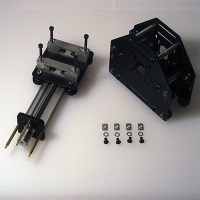

Turn the eccentric nuts on the Spindle Carriage Assembly (PS20029) so that they move the matching V-wheels as far as possible from the opposing static V-wheels. Slide the Spindle Carriage Assembly onto the Z-Axis Rail Assembly and turn the threaded rod using the flexible coupler so that the V-wheels are completely on the MakerSlide V-rail. Be careful not to nick or damage the Delrin V-wheels.

##Sub Gantry (PS20023)

###Requirements

####Parts

- 1 PS20021 Z-Assembly Carriage
- 1 PS20022 Motor Mount Carriage
- 1 PS20030 Complete Z-Axis Assembly
- 6 25312-20 1-1/4" #12 Bore, Aluminum Spacer
- 6 PS20006 M5 x 70mm SHCS
- 12 25287-02 Flat Washer, M5
- 6 PS20002 3/8" x 1-1/4" x #12 bore, Aluminum Spacer
- 6 25284-02 M5 Hex Nut

If possible, select a Motor Mount Carriage (PS20022) which has a stepper motor attached. 

Place washers on the M5 x 70 mm SHCS (PS20006) and place them in the outer holes of the Z-Assembly Carriage (PS20021) from the side opposite the V-wheels. Place one each of the Aluminum Spacers (25312-20 and PS20002) on each bolt, place the Motor Mount Carriage (PS20022) onto the bolts and attach using an M5 washer and M5 hex nut.

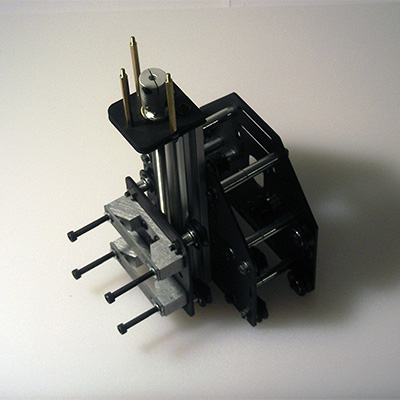