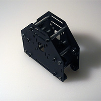
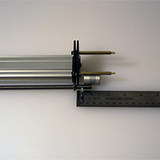

# Z-Axis Assembly

The Z-axis assembly is comprised of several sub-assemblies. When assembling it, it is best to select a Motor Mount Carriage (PS20022) which already has a stepper motor in place.

##Z Assembly Carriage (PS20021)

  
 

###Requirements

####Parts

- 1 26029-01 Motor Mount Plate (12ga)
- 2 30158-01 Eccentric Nut
- 4 25203-02 Dual Bearing V-Wheel Kit (assembly)
- 4 PS20004 M5x20mm BHCS
- 6 25287-02 Flat Washer, M5
- 2 25284-02 M5 Hex Nut

This is the plate the Z-axis will attach to (it is identical to the Motor Mount Carriage (PS20022) assembled in the previous step, but without smooth idlers. It sits on the front of the gantry and will be connected to the X-axis motor mount plate via rigid aluminum spacers. We will build the plate first, and then attach the two together.

1. Connect V-Wheels to plate
	- two static at the top
	- two eccentric at the bottom

##Spindle Carriage Assembly (PS20029)

    

Note: The above exploded view does not show the wavy washer.

###Requirements

####Parts

- 1 30287-01 Spindle Mount Plate (12ga)
- 1 PS20010 13mm x 35mm x 20mm Delrin Lead nut
- 10 25287-02 Flat Washer, M5
- 6 25284-02 M5 Hex Nut
- 2 PS20012 Universal Spindle Mount
- 2 30158-01 Eccentric Nut
- 4 25202-01 V-Wheel, Delrin
- 8 25196-01 5mm x 16mm x 5mm Bearing
- 4 25201-01 precision 1mm spacer
- 4 25312-14 3/8" x 5/16" x #12 bore, aluminum spacer
- 4 25286-05 M5 x 30mm, BHCS
- 6 25286-02 M5 x 12mm, BHCS
- 2 PS20013 Universal Spindle Mount strap
- 4 PS20005 M5 x 45mm, SHCS

##Z-Axis Rail Assembly (PS20028)

  
 

One should also attach the motor for the Z-axis at this time.

Note: Depending on how deeply tapped on the stepper motor and how long the threads are on the brass standoffs, it may be necessary to add additional M3 washers when attaching the motor using the brass standoffs.

###Requirements

####Parts

- 1 25142-07 Z Axis Rail MakerSlide Extrusion 200mm
- 1 25772-02 Z-Axis Flexible Coupler 5mm 8mm bore
- 2 30288-01 Z-Axis Motor Mount Plate (12ga)
- 1 30169-01 8x22x7mm flanged bearing
- 1 30289-01 Z-Axis Shim Plate (12ga)
- 1 PS20011 M8 Threaded Rod Stainless Steel, 200mm
- 2 25287-02 Flat Washer, M5
- 3 PS20014 Brass Standoff spacer M3 male x M3 female 50mm
- 4 PS20016 5mm x 10mm x 1mm thick,  nylon spacer
- 2 PS20004 M5x20mm BHCS
- 6 PS20015 3mm x 8mm x 1mm thick, Nylon Spacer
- 3 25285-10 M3 x 12mm, SHCS
- 3 25287-03 Flat Washer, M3
- 2 PS20007 M8, Hex Nut

###Mount Plate

###Threaded Rod

###Jam Nuts

###Spindle Mount

###Spindle Clamps

