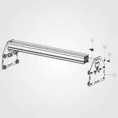
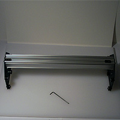
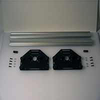
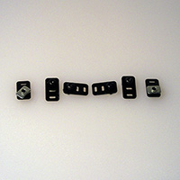
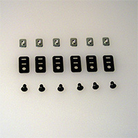
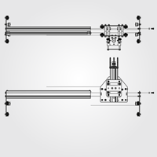
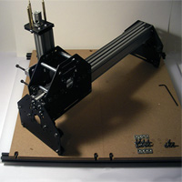
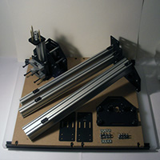

# Gantry

##Sub Gantry (PS20023)

- 2 x PS20022 Motor Mount Carriage
- 2 x PS20020 Belt Clip Assembly
- 8 x 25286-02 M5 x 12mm, BHCS
- 8 x 25287-02 Flat Washer, M5
- 2 x PS20008 X/Y Axis Rail MakerSlide Extrusion 500mm

 

**Note:** Do not attach one end plate during this step (despite the photograph showing this). Slide the Z-Axis Assembly gantry carriage (PS20031) from the previous step onto the gantry (see below) before attaching the second motor mount plate.

This is evident in the next step.

Push the MakerSlide as far as is possible to one end of the slot which the 12mm M5 bolts fit through. Only tighten the pair of bolts on the MakerSlide which is snugged up against the end of the slot, the other should be slightly loose. Note that there is a space in-between the two pieces of MakerSlide. This spacing will be set in a following step.

### Belt Anchors

The belt anchors must be assembled and placed on the MakerSlide before attaching the second Motor Mount Carriage.

##Complete Gantry (PS20025)

  
 

**Note:** the parts picture above shows some extra parts which will be used in the next step.

Turn the eccentric nuts on the V-wheels on the Gantry Carriage (PS20031) so that they are as far from the static V-wheels as is possible. Carefully roll the Gantry Carriage onto the two pieces of MakerSlide, facing the spindle carriage away from the MakerSlide which is bolted in place at the extreme edge of the slot. Move the Gantry Carriage as close to the attached Motor Mount Carriage Plate as is possible, tighten the bolts for the loose MakerSlide. Attach the other Motor Mount Carriage in the same fashion, pushing down on the MakerSlide to ensure that everything is square. Ensure that the Gantry moves smoothly for the entire length of the X-axis. If necessary, loosen the M5 bolts and adjust the fit until everything is square and the gantry travels smoothly.

