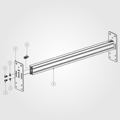
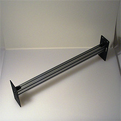
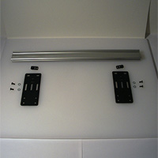

# End Plates

##Y-Axis Rail Assembly (PS20026)

### Overview
 

**Note:** Although the assembly photo shows both end plates attached, only attach one to each Y-axis rail at this time.

### Requirements

####Parts
* End Plate (12ga) 26028-01
* M5 x 12mm, BHCS 25286-02 
* Flat Washer, M5 25287-02 
* Belt Clip Assembly PS20020 
* X/Y Axis Rail - MakerSlide Extrusion - 500mm PS20008

Attach one end plate to each piece of MakerSlide using the 12mm M5 bolts and an M5 washer.

Do not attach the second end plate, that will be done in the next step.