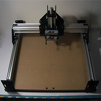
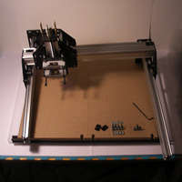
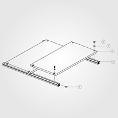
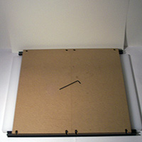
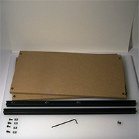
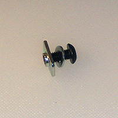

# Work Area

## Overview

##Waste Board Assembly (PS20024)

- 8 25286-02 M5 x 12mm, BHCS
- 8 25287-02 Flat Washer, M5
- 8 26016-01 M5 insertion nut
- 2 PS20001 MDF wasteboard (1/2")
- 2 PS20009 20mm x 20mm x 550mm aluminum extrusion, black anodized

   

### 20x20 Extrusions
Slide Entire  Assembly over wasteboard Assembly, fasten with:

- M5x10
- M5 washer
- Insertion Nut

### Squaring the Table

Square up the wasteboard assembly carefully, since it will be the foundation for the balance of the machine.

* 2 Y-Axis Rail Assembly (PS20026)
* Complete Gantry (PS20025)
* Waste Board Assembly (PS20024)

Turn the eccentric nuts on the V-wheels on the Complete Gantry (PS20025) so that they are as far from the static V-wheels as is possible. Drive the Complete Gantry onto the two Y-Axis Rail Assemblies (PS20026), then attach the open end plates.

Place the 10mm M5 bolts w/ washers into the bottom holes on the open end plates, thread on the insertion nuts, then carefully slide the rail assemblies onto the wasteboard extrusion. Ensure that everything is aligned squarely and that the Complete Gantry and the X-Axis Sub Gantry move smoothly. Tighten the bolts.

Congratulations! You've built a ShapeOko!

